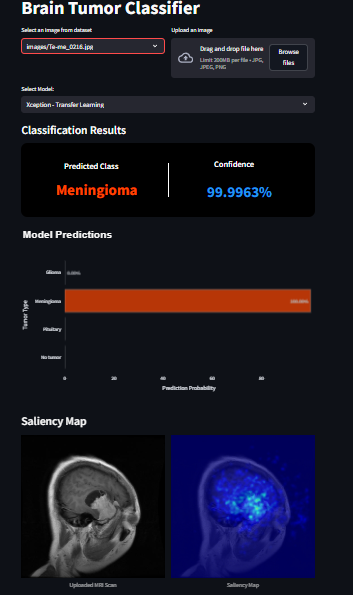

# Brain Tumor Classifier
A machine learning project utilizing CNN models to detect brain tumors in MRI scans, showcased through an interactive Streamlit app.  
Visit here: [Brain Tumor Classifier](https://brain-tumor-classifier-7.streamlit.app/)

## Preview


## Features
- **User-Friendly Upload & Predict**: Easily upload MRI images and receive tumor classification results.
- **Multi-Model Architecture**: Utilizes three models (Xception, MobileNet, Custom CNN).
- **Saliency Map Generation**: Visualizes areas of the MRI that influenced the model’s prediction, enhancing interpretability.
- **Chat with LLM**: A built-in chat with an LLM to explain model predictions and provide insights on tumor types and treatment implications.

## Models
- **Xception (Transfer Learning)**: A robust deep learning model with strong feature extraction capabilities, achieving 98% accuracy in brain tumor classification.
- **MobileNet (Transfer Learning)**: A lightweight and efficient model, optimized for speed, with a 99% accuracy rate.
- **Custom CNN**: A specialized convolutional neural network, fine-tuned for this specific task, delivering 98% accuracy.

## Installation
To run this project locally, follow these steps:
1. Clone the repository:
    ```bash
    git clone https://github.com/rafiks7/Brain-Tumor-Classifier.git
    ```
2. Install the required dependencies:
    ```bash
    pip install -r requirements.txt
    ```
3. Run the Streamlit app:
    ```bash
    streamlit run app.py
    ```

## Requirements
[requirements](requirements.txt)
